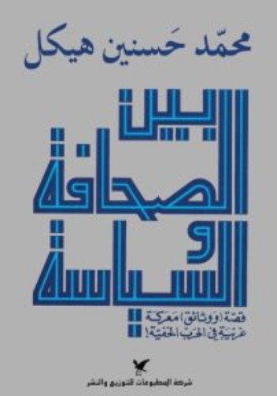
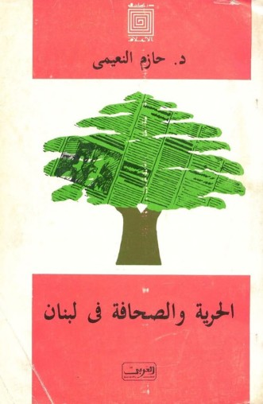
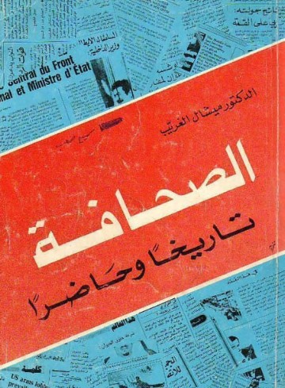
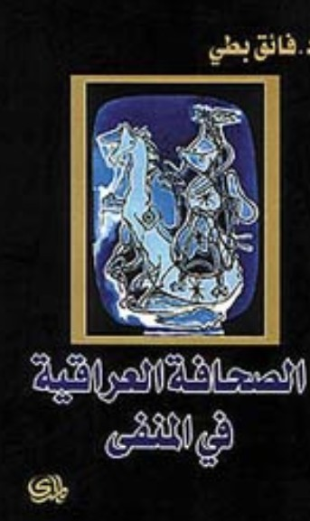
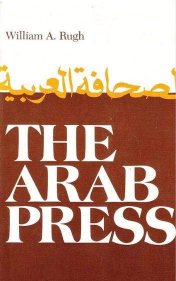
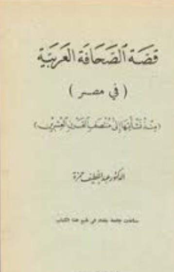

*Titles from the collection on the history of the Arab press.*

The Rif'at al-Sa'id Library holds a rich collection of Arabic-language books on the history of journalism and the press in the Arab world. These works serve as valuable primary and secondary sources for researchers seeking to understand how social and political forces shaped journalism in the Middle East during the mid-twentieth century.

The collection includes books from across the region. Below are some highlighted titles within the collection. To locate all books related to journalism in the Arab world in our database, search using the keyword “Journalism” in the Rif'at al-Sa'id Library.

### *Bayna al-siḥāfah wa-al-siyāsah: qiṣṣat (wa-wathāʼiq) maʻrakah gharībah fī al-ḥarb al-khafīyah/بين الصحافة والسياسة : قصة (ووثائق) معركة غريبة في الحرب الخفية*

- **Author:** Muḥammad Ḥasanayn Haykal/محمد حسنين هيكل

- **Location in Rif'at al-Sa'id Library:** Range 2, Shelf H

- **About:** Published in 1984, in Bayna al-siḥāfah wa-al-siyāsah Muḥammad Ḥasanayn Haykal argues that the press plays a central role in a nation’s politics. He traces the history of journalism in Egypt from the Second World War to the era when Hosni Mubarak assumed power. As a prominent journalist and editor-in-chief of the popular newspaper Al-Ahram, Haykal draws on his firsthand experience to analyze the development and influence of the Egyptian press. This book serves both as an important primary source, reflecting Haykal’s direct involvement in the field, and a secondary source, providing an analysis of Egyptian media and its impact on society and politics.

### *al-Ḥurrīyah wa-al-ṣiḥāfah fī Lubnān/الحرية والصحافة في لبنان*

- **Author:** Ḥāzim Nuʻaymī/حازم النعيمي

- **Location in Rif'at al-Sa'id Library:** Range 2, Shelf H

- **About:** Published in 1989 by al-ʻArabī lil-Nashr wa-al-Tawzīʻ as part of its series on journalism studies, this book by Dr. Nuʻaymī examines how journalism in Lebanon developed differently from the rest of the Arab world. He argues that Lebanon’s pluralism and religious diversity shaped its journalistic environment. The book traces the history of the Lebanese press from its beginnings in 1858 and analyzes the degrees of freedom within Lebanese media. Dr. Nuʻaymī both critiques and highlights the strengths of Lebanese journalism, offering insight into why it occupied a unique position in the region.

### *al-Ṣiḥāfah: Tārīkhān wa-Ḥāḍiran/الصحافة: تاريخا وحاضرا*

- **Author:** Mīshāl al-Gharīb/ميشال الغريب

- **Location in Rif'at al-Sa'id Library:** Range 2, Shelf H

- **About:** Published in 1978, this book compares the rules and systems of journalism in the Arab world, tracing their development from the Ottoman period to the era of Arab sovereignty and independence. Its author, Michael al-Ghrayeb, was a prominent Lebanese journalist and political activist who studied law and communication in both France and Lebanon. Through his activism, Ghrayeb also established a trade and typing school in Beirut and founded a cultural council to foster Lebanese intellectualism.

### *al-Ṣiḥāfah al-ʻIrāqīyah fī al-manfá/الصحافة العراقية في المنفى*

- **Author:** Fāʼiq Buṭṭī/فائق بطي

- **Location in Rif'at al-Sa'id Library:** Range 2, Shelf H

- **About:** Published in 2006, this book explores the voices of Iraqis living in exile and how they use journalism in the West and neighboring Arab countries to share their stories. This is one of the many works on journalism by Butti, however, this book stands out for its focus on the Iraqi diaspora and their efforts to keep their perspectives visible through the press and the media. Butti comes from a strong journalistic background with his father owning the Iraqi newspaper al-Bilad, which was later passed down to him.

### *The Arab press: news media and the political process in the Arab world*

- **Author:** William A. Rugh

- **Location in Rif'at al-Sa'id Library:** Range 2, Shelf H

- **About:** Published in 1979, this book offers a Western perspective on the field of journalism in the Arab world. It serves as an introductory foundation for understanding major newspapers and media systems in the region, along with their political, religious, and social affiliations. The author, William Rugh, was a United States ambassador to several Middle Eastern countries between 1964 and 1995, bringing a distinct perspective as a foreign observer of the region’s media landscape.

### *Qiṣṣat al-Ṣaḥāfah al-ʻArabīyah fī Miṣr mundh nashʼatihā ilá muntaṣaf al-qarn al-ʻishrīn/قصة الصحافة العربية في مصر منذ نشأتها الى منتصف القرن العشرين*

- **Author:** ʻAbd al-Laṭīf Ḥamzah /عبد اللطيف حمزة

- **Location in Rif'at al-Sa'id Library:** Range 2, Shelf H

- **About:** Published in 1967, this book by Hamzah explores the development of journalism in Egypt from its inception to the modern period. The author was a well-traveled Egyptian intellectual who studied and taught journalism at Cairo University, where he also contributed to establishing the department of journalism and media.

### *Fī al-ṣiḥāfah/في الصحافة*

- **Author(s):** Yūsūf Muḥammad Dasūqī and Muḥammad Kāmil Dasūqī/ يوسف محمد دسوقي و محمد كامل دسوقي

- **Location in Rif'at al-Sa'id Library:** Range 2, Shelf H

- **About:** This 1929 book draws on the independent observations and inquiries of its authors, who were involved in education and law in Egypt. It examines how the press operated in general and how it functioned specifically within the Egyptian context. The authors trace the history of the press and discuss key factors such as journalist unions and editorial policies of the period. Although the authors were not directly involved in journalism, their backgrounds in key Egyptian societal roles provide valuable context for understanding the politics of journalism during the era of King Farouq and the rule of the Wafd Party in Egypt.

### *al-Ṣaḥīfah al-Jidārīyah al-ʿUmmālīyah/الصحيفة الجدارية العمالية*

- **Author**: Razzāq Ibrāhīm Ḥasan/ رزاق ابراهيم حسن

- **Location in Rif'at al-Sa'id Library:** Range 2, Shelf H

- **About:** Published in 1976, this book by Razzāq Ibrāhīm Ḥasan explores the development and role of workers’ newspapers. Ḥasan was an Iraqi journalist and poet deeply involved in workers’ rights. He also wrote for the magazine *Waʿī al-ʿUmmāl (وعي العمال)*, where he examined similar themes, including the relationship between the press and labor unions. Similar to other titles in this collection, this book offers an important window into the voices of Arab journalists in the twentieth century, however, what sets it apart is its focus on popular journalism in modern Arab press history.

Abu-Lughod, I. (1980). The Arab Press: News Media and Political Process in the Arab World. By William A. Rugh. (Syracuse, N.Y.: Syracuse University Press, 1979. Pp. xviii + 205. 5.95, paper.). *American Political Science Review, 74*(3), 857–858. [https://doi.org/10.2307/1958216](https://doi.org/10.2307/1958216)

As-Safir. (1978). »الصحافة تاريخا وحاضرا«. [https://archive.assafir.com/](https://archive.assafir.com/)

As-Safir. (n.d.). د. ميشال غريّب... قلب من ذهب! [https://archive.assafir.com/](https://archive.assafir.com/)

William A. Rugh | American Academy of Diplomacy. (n.d.). Academyofdiplomacy. [https://www.academyofdiplomacy.org/members-1/rugh/william-a](https://www.academyofdiplomacy.org/members-1/rugh/william-a).

تطور الصحافة المصرية 1798-1981 | مجلد 1 | صفحة 6 | فصل في مراجع البحث | التاريخ | جامع الكتب الإسلام. (n.d.). [https://ketabonline.com/ar/books/1031/read?part=1&page=4&index=688708&q=%D8%AF%D8%B3%D9%88%D9%82%D9%8A%D8%8C%20%D9%8A%D9%88%D8%B3%D9%81%20%D9%85%D8%AD%D9%85%D8%AF](https://ketabonline.com/ar/books/1031/read?part=1&page=4&index=688708&q=%D8%AF%D8%B3%D9%88%D9%82%D9%8A%D8%8C%20%D9%8A%D9%88%D8%B3%D9%81%20%D9%85%D8%AD%D9%85%D8%AF)

حمدي العطار: رحل رزاق ابراهيم “غوركي العراق” | رأي اليوم. (n.d.). [http://web.archive.org/web/20200110140049/https://www.raialyoum.com/index.php/%D8%B1%D8%AD%D9%84-%D8%B1%D8%B2%D8%A7%D9%82-%D8%A7%D8%A8%D8%B1%D8%A7%D9%87%D9%8A%D9%85-%D8%BA%D9%88%D8%B1%D9%83%D9%8A-%D8%A7%D9%84%D8%B9%D8%B1%D8%A7%D9%82/](http://web.archive.org/web/20200110140049/https://www.raialyoum.com/index.php/%D8%B1%D8%AD%D9%84-%D8%B1%D8%B2%D8%A7%D9%82-%D8%A7%D8%A8%D8%B1%D8%A7%D9%87%D9%8A%D9%85-%D8%BA%D9%88%D8%B1%D9%83%D9%8A-%D8%A7%D9%84%D8%B9%D8%B1%D8%A7%D9%82/)

كتاب الصحافة العراقية في المنفى—فائق بطي—مكتبة تكوين. (n.d.). [https://takweenkw.com/book/10158/single](https://takweenkw.com/book/10158/single)

نور, م. (n.d.). كتاب بين الصحافة والسياسة قصة ووثائق معركة غريبة في الحرب الخفية. [https://www.noor-book.com/book/review/490720](https://www.noor-book.com/book/review/490720)

نور, م. (n.d.). كتاب الصحافة العراقية في المنفى. [https://www.noor-book.com/book/review/545900](https://www.noor-book.com/book/review/545900)

نور, م. (n.d.). تحميل كتاب قصة الصحافة العربية في مصر منذ نشأتها الى منتصف القرن العشرين pdf. [https://www.noor-book.com/كتاب-قصه-الصحافه-العربيه-في-مصر-منذ-نشاتها-الي-منتصف-القرن-العشرين-pdf-1593220192](https://www.noor-book.com/%D9%83%D8%AA%D8%A7%D8%A8-%D9%82%D8%B5%D9%87-%D8%A7%D9%84%D8%B5%D8%AD%D8%A7%D9%81%D9%87-%D8%A7%D9%84%D8%B9%D8%B1%D8%A8%D9%8A%D9%87-%D9%81%D9%8A-%D9%85%D8%B5%D8%B1-%D9%85%D9%86%D8%B0-%D9%86%D8%B4%D8%A7%D8%AA%D9%87%D8%A7-%D8%A7%D9%84%D9%8A-%D9%85%D9%86%D8%AA%D8%B5%D9%81-%D8%A7%D9%84%D9%82%D8%B1%D9%86-%D8%A7%D9%84%D8%B9%D8%B4%D8%B1%D9%8A%D9%86-pdf-1593220192)

نور, م. (n.d.). كتب الحرية والصحافة فى لبنان. [https://www.noor-book.com/tag/الحرية-والصحافة-فى-لبنان](https://www.noor-book.com/tag/%D8%A7%D9%84%D8%AD%D8%B1%D9%8A%D8%A9-%D9%88%D8%A7%D9%84%D8%B5%D8%AD%D8%A7%D9%81%D8%A9-%D9%81%D9%89-%D9%84%D8%A8%D9%86%D8%A7%D9%86)
