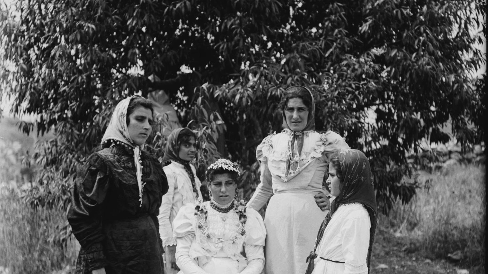

Arab women have long been active participants in shaping the political, intellectual, and cultural life of their societies, working alongside their male counterparts while also carving out distinct spaces of influence and leadership. Across different historical periods, they have contributed as writers, activists, educators, journalists, and organizers, often navigating complex systems of power. Our library celebrates these achievements by showcasing a broad collection of works that highlight the lives and legacies of prominent women from across the region. These materials not only tell individual stories, but also illuminate the broader structures of marginalization that many Arab women have faced, whether under imperial rule, shifting political regimes, or within patriarchal social frameworks. Our collection includes titles that explore women’s issues across the region, including the Gulf countries, Egypt, Iraq, Yemen, Palestine, and beyond.

Below are some highlighted titles within the collection. To locate all books related to women in the Arab world in our database, search using the keyword “Women” in all of our libraries.

*Bride in Nazareth, ca. 1910. Detail from one half of a stereograph held in the collection.*

### *Dreaming of Baghdad*

- **Author:** Haifa Zangana

- **Location in the center**: *Barbara Harlow Library*– Range 20, Shelf A

- **About:** Published in 2009 by the Feminist Press at the City University of New York, this memoir traces Haifa Zangana’s resistance to the rule of Saddam Hussein, detailing her political activism and imprisonment during the 1970s. The book offers a powerful perspective from an Arab woman confronting both state corruption and the added challenges of gender-based marginalization. Zangana, who has written extensively on feminism, leftist ideologies, and Middle Eastern politics and currently writes for well known publications such as *the Guardian* and *Middle East Monitor*. In this book she provides an accessible and compelling introduction to her work as a foundational Iraqi activist

### *Egyptian women in social development: a resource guide*

- **Author:** Network of Egyptian Professional Women

- **Location in the center**: *Rif'at al-Sa'id Library* – Range 3, Shelf A

- **About:** Published in 1988 by the American University in Cairo, this book by the Network of Egyptian Professional Women presents hundreds of case studies highlighting Egyptian women and their contributions to society. Functioning in part as a directory of prominent women of the period, it illustrates how Egyptian women were actively building professional and social networks. The work serves as a valuable resource for researchers seeking insight into the Egyptian workforce and the roles women occupied within it.

### *Images of Arab women: fact and fiction: essays*

- **Author:** Mona Mikhail

- **Location in the center**: *Rif'at al-Sa'id Library* – Range 1, Shelf C

- **About:** Published 1979 this book by the NYU professor Emeritus, Mona Mikhlail was one of the first English language academic books to explore women’s liberation in the Arab world. The book explores the role of women in Arab society and argues against the western misconception about Muslim and Arab women. It is split into two sections with the first half laying out the social and historical background of women in the Arab world and the second half focuses on their depictions in literature and folklore. Mikhlail combines broad, analytical reflections with chapters focused on specific women who serve as illustrative case studies. She draws on her own observations and feminist interpretations, supporting them with references to Islamic texts, including Qur’anic verses. The result is a distinctive example of Islamic feminism that demonstrates the possibility of engaging both faith and feminist thought without privileging one over the other.

### *Mushkilāt al-marʼah al-ʻāmilah al-Kuwaytīyah wa-al-Khalījīyah wa-ittijāhātuhā/مشكلات المرأة العاملة الكويتية والخليجية واتجاهاتها*

- **Author:** ʻAbd al-Raʼūf ʻAbd al-ʻAzīz Jardāwī/عبد الرءوف عبد العزيز الجرداوي

- **Location in the center**: *Barbara Harlow Library*– Range 20, Shelf C

- **About:** Published in 1986, this book examines the experiences of working Arab women, with a particular focus on the Gulf region and Kuwait. The author analyzes women’s levels of education alongside their participation across various sectors of the economy. Combining contemporary statistical data with scholarly analysis, the book provides valuable insight into the challenges Kuwaiti and Arab women faced in entering and navigating the workforce. Al-Jawardi is a Kuwaiti academic who has written many pieces on the sociopolitical conditions of his country.

Dreaming of Baghdad. (n.d.). Feminist Press. [https://feministpress.org/products/9781558616059-dreaming-of-baghdad](https://feministpress.org/products/9781558616059-dreaming-of-baghdad)

Haifa Zangana. (2014, January 8). Middle East Monitor. [https://www.middleeastmonitor.com/authors/haifa-zangana/](https://www.middleeastmonitor.com/authors/haifa-zangana/)

Haifa Zangana | The Guardian. (n.d.). [https://www.theguardian.com/profile/haifazangana](https://www.theguardian.com/profile/haifazangana)

Home Page. (n.d.). Union of Palestinian American Women. [https://www.unionpalestinianwomen.com/](https://www.unionpalestinianwomen.com/)

Shuiskii, S. (1980). [Review of *Images of Arab Women: Fact and Fiction. Essays*, by M. Mikhail, G. M. Badr, & G. Asfor]. *Oriente Moderno, 60*(7/12), 514–515.

Women, T. N. of E. P. (1988). *Egyptian women in social development: A resource guide*. [https://www.africabib.org/rec.php?RID=05250641X](https://www.africabib.org/rec.php?RID=05250641X)

عبدالعزيز، ا., & أحمد (عارض)، ا. ل. (1990). مشكلات المرأة العاملة الكويتية والخليجية واتجاهاتها. *مجلة العلوم الاجتماعية*, 0(0), 204–206.
